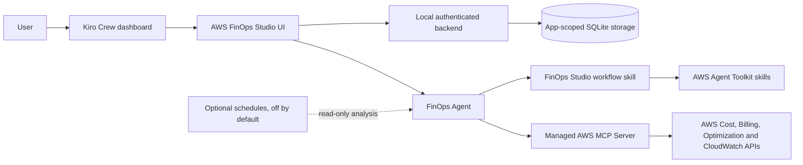

# AWS FinOps Studio

AWS FinOps Studio is a locally runnable, read-only Kiro Crew App for AWS cost understanding, anomaly investigation, optimization prioritization, commitment analysis, Well-Architected Cost Optimization reviews, recommendation lifecycle tracking, and reports. It is a workspace—not a thin chat wrapper: the UI provides overview, explorer, optimization, anomaly, resource, commitment, review, report, history, and connection surfaces, while a dedicated FinOps Agent handles evidence-backed investigation.

Demo Mode works without AWS credentials and is always labeled. Demo values are never combined with live results.

## Architecture



Financial flow is always `AWS data → deterministic calculation → structured evidence → LLM explanation`. The LLM is prohibited from inventing or mentally calculating financial values.

## Components

- `app.json`: Kiro Crew 0.9 App Kit manifest, scoped permissions, Billing & Cost Management MCP declaration.
- `ui/`: React/Vite ESM app with 4 Persona lenses (Practitioner, Finance, Engineering, Leadership), scope indicator, MoM deltas, and immutable evidence audit log.
- `backend/`: loopback-only, gateway-HMAC-authenticated API, STS caller identity verification, deterministic calculations (`/calculate`), and app-scoped SQLite persistence (`evidence_runs` & `recommendations`).
- `agents/finops-agent.json`: dedicated, read-only FinOps agent.
- `skills/finops-studio/`: product workflow; AWS domain guidance remains upstream-owned.
- `tests/`: deterministic analytics, variance, credit ratios, service deltas, allocation coverage, durable persistence, and error contracts.

## Execution and data planes

The application uses a hybrid, least-privilege data model:
1. **Summary & Identity Plane (Backend)**: For fast dashboard refreshes, the Python backend executes read-only `aws ce get-cost-and-usage` (monthly, `UnblendedCost`, pre-adjustments and service groups) and `aws sts get-caller-identity`. Every query is cryptographically hashed with SHA-256 and persisted in local SQLite alongside the query spec and masked account identity (`evidence_runs`), ensuring live evidence survives server restarts.
2. **Deep Investigation Plane (FinOps Agent)**: In-depth conversational investigations run through the agent backed by the official AWS Labs Billing and Cost Management MCP server (`cost-explorer`, `sp-performance`, `sp-explorer`).
3. **Deterministic Calculation Plane**: All totals, variances, deltas, and coverage percentages are calculated by `backend/analytics.py` and exposed via `/api/calculate`. The LLM is never permitted to perform mental math on financial data.

## Persona lenses

FinOps Studio provides audience-specific lenses over the same governed evidence:
- **Practitioner**: Query provenance, raw SHA-256 hashes, record-type ledger, and audit history.
- **Finance**: Pre-adjustment unblended cost, credits applied, credit-to-gross ratio, refunds, and net billed ledger.
- **Engineering**: Top cost drivers, Month-over-Month cost deltas (+/- $ and %), and actionable rightsizing.
- **Leadership**: Executive cost trajectory, active optimization pipeline, and verified realized savings.

## AWS Authentication, Multi-Profile Switching & Least-Privilege IAM

AWS FinOps Studio is built with an enterprise least-privilege security model. It operates in 100% read-only mode and never mutates AWS infrastructure or purchases commitments.

### Multi-Profile & Multi-Account Support (AWS Control Tower & SSO)

If you manage multiple AWS accounts (e.g. AWS Control Tower, IAM Identity Center / SSO, or separate `dev`, `stage`, `prod` profiles), FinOps Studio discovers and supports them automatically:

1. **Automatic Discovery**: Discovers all configured profiles from:
   - `~/.aws/credentials`
   - `~/.aws/config` (including SSO/role-assumption profiles like `[profile prod]`)
   - `aws configure list-profiles`
2. **Dynamic Switching**:
   - **Sidebar Switcher**: Select any discovered profile directly from the Active Scope dropdown in the sidebar.
   - **Connection Center**: Go to the **Connection** tab to switch profiles, change target regions, and verify caller identity in real time.
3. **Durable Scope Persistence**: Your selected profile and region are saved in local SQLite (`app_config`), ensuring the app remembers your preferred account context across reboots and restarts.
4. **Provenance & Evidence Scoping**: Billing queries and evidence hashes are scoped to the active profile, preventing accidental data mixing between different AWS accounts.

---

### In-App IAM Policy Helper & Tiered Policies

Inside the **Connection** tab, FinOps Studio features an interactive **IAM Least-Privilege Policy Helper**. You can choose your preferred security tier, inspect the permissions, and click **"📋 Copy Policy JSON"** to paste directly into AWS IAM.

#### 1. Full FinOps Read-Only Policy (Recommended)
Combines all read-only permissions needed for spend breakdown, anomaly analysis, rightsizing, commitments, and CloudWatch metrics into a single clean policy.

<details>
<summary><b>View JSON: Full FinOps Read-Only Policy (`docs/iam-readonly-policy.json`)</b></summary>

```json
{
  "Version": "2012-10-17",
  "Statement": [
    {
      "Sid": "FinOpsReadOnly",
      "Effect": "Allow",
      "Action": [
        "sts:GetCallerIdentity", "ce:Get*", "ce:List*", "cost-optimization-hub:Get*", "cost-optimization-hub:List*",
        "compute-optimizer:Get*", "compute-optimizer:Describe*", "budgets:ViewBudget", "savingsplans:Describe*",
        "cloudwatch:GetMetricData", "cloudwatch:GetMetricStatistics", "cloudwatch:ListMetrics",
        "ec2:Describe*", "rds:Describe*", "lambda:GetFunction", "lambda:GetFunctionConfiguration", "lambda:ListFunctions",
        "ecs:Describe*", "ecs:List*", "eks:Describe*", "eks:List*", "s3:GetAccountPublicAccessBlock",
        "s3:GetBucketLocation", "s3:GetBucketTagging", "s3:ListAllMyBuckets", "organizations:Describe*", "organizations:List*",
        "billing:GetBillingViewData", "billing:ListBillingViews", "cur:DescribeReportDefinitions", "bcm-data-exports:GetExport", "bcm-data-exports:ListExports"
      ],
      "Resource": "*"
    }
  ]
}
```
</details>

#### 2. Tier 1: Minimal Spend & Cost Explorer
Minimum viable policy for basic spend visibility and ledger reconciliation without rightsizing metrics.

<details>
<summary><b>View JSON: Tier 1 Spend Policy (`docs/iam-summary-policy.json`)</b></summary>

```json
{
  "Version": "2012-10-17",
  "Statement": [
    {
      "Sid": "FinOpsStudioSummaryReadOnly",
      "Effect": "Allow",
      "Action": [
        "sts:GetCallerIdentity",
        "ce:GetCostAndUsage",
        "ce:GetDimensionValues",
        "ce:GetCostForecast",
        "billing:ListBillingViews",
        "billing:GetBillingViewData"
      ],
      "Resource": "*"
    }
  ]
}
```
</details>

#### 3. Tier 2: Optimization Engines (COH & Compute Optimizer)
Adds rightsizing and idle resource detection.

<details>
<summary><b>View JSON: Tier 2 Optimization Policy (`docs/iam-optimization-policy.json`)</b></summary>

```json
{
  "Version": "2012-10-17",
  "Statement": [
    {
      "Sid": "FinOpsStudioOptimizationReadOnly",
      "Effect": "Allow",
      "Action": [
        "cost-optimization-hub:Get*",
        "cost-optimization-hub:List*",
        "compute-optimizer:Get*",
        "compute-optimizer:Describe*",
        "cloudwatch:GetMetricData",
        "cloudwatch:GetMetricStatistics",
        "cloudwatch:ListMetrics"
      ],
      "Resource": "*"
    }
  ]
}
```
</details>

#### 4. Tier 3: Commitments & Savings Plans
For analyzing Savings Plans and Reserved Instance coverage without purchase capabilities.

<details>
<summary><b>View JSON: Tier 3 Commitments Policy (`docs/iam-commitments-policy.json`)</b></summary>

```json
{
  "Version": "2012-10-17",
  "Statement": [
    {
      "Sid": "FinOpsStudioCommitmentsReadOnly",
      "Effect": "Allow",
      "Action": [
        "savingsplans:Describe*",
        "ce:GetSavingsPlansCoverage",
        "ce:GetSavingsPlansUtilization",
        "ce:GetSavingsPlansPurchaseRecommendation",
        "ce:GetReservationCoverage",
        "ce:GetReservationUtilization",
        "ce:GetReservationPurchaseRecommendation"
      ],
      "Resource": "*"
    }
  ]
}
```
</details>

---

### How to Attach the IAM Policy in AWS

1. Log in to the [AWS Management Console](https://console.aws.amazon.com/).
2. Navigate to **IAM > Policies > Create Policy**.
3. Select the **JSON** tab and paste the copied policy JSON.
4. Name the policy `AWSFinOpsStudioReadOnlyPolicy` and click **Create Policy**.
5. Attach this policy to the **IAM User** or **IAM Role** associated with your AWS CLI profile (e.g., `default`, `prod`, etc.).
6. In FinOps Studio, navigate to the **Connection** tab and click **"Test Connection"** to verify that STS identity and permissions pass.

---

### Free Optimization Service Opt-In Instructions

Both **AWS Cost Optimization Hub** and **AWS Compute Optimizer** provide automated rightsizing recommendations at **zero cost**:
- **Cost Optimization Hub**: 100% Free. Aggregates recommendations across all AWS optimization engines.
- **Compute Optimizer Standard Tier**: 100% Free. Analyzes CloudWatch metrics over 14 days for EC2, EBS, Lambda, and ECS.

To activate them for your profile, run these one-time commands in your terminal:

```bash
# 1. Opt-in to AWS Cost Optimization Hub (100% Free)
aws cost-optimization-hub update-enrollment-status --status Active --profile <YOUR_PROFILE> --region <YOUR_REGION>

# 2. Opt-in to AWS Compute Optimizer (100% Free Standard Tier)
aws compute-optimizer update-enrollment-status --status Active --profile <YOUR_PROFILE>
```

---

## Dual Platform Deployment

AWS FinOps Studio runs identically across two environments:

### Platform 1: Kiro Crew App (Integrated Mode)
Installed directly into the Kiro Crew dashboard gateway (`~/.kiro/crew/apps/aws-finops-studio`):
- Uses signed proxy HMAC authentication via `verify_proxy_request`.
- Access via Kiro Crew Dashboard at `http://127.0.0.1:5477/apps/aws-finops-studio`.
- Leverages the app-scoped FinOps Agent (`finops-agent.json`) for natural language financial conversations.

### Platform 2: Local Standalone Mode
Run locally as a standalone service during development or in headless environments:
```bash
# Start backend on port 9100
export FINOPS_DEV_ALLOW_DIRECT=1
python3 backend/server.py

# In another terminal, start UI dev server
cd ui && npm run dev
```

---

## Troubleshooting Guide

### 1. `AccessDenied` or `AccessDeniedException`
- **Cause**: The IAM User or Role for the active profile lacks Cost Explorer or Billing permissions.
- **Fix**: Open the **Connection** tab, copy the **Full FinOps Read-Only Policy**, and attach it to your IAM identity in AWS IAM.
- **Verification**: In terminal, run: `aws sts get-caller-identity --profile <YOUR_PROFILE>`.

### 2. Cost Optimization Hub or Compute Optimizer Shows Inactive (`○`)
- **Cause**: The account has not enrolled in the free optimization services.
- **Fix**: Run the one-time opt-in commands listed above or in the in-app IAM Policy Helper.

### 3. Multiple AWS Profiles Missing from Dropdown
- **Cause**: Profiles are configured with non-standard section headers or AWS CLI is missing.
- **Fix**: Ensure your profiles are defined in `~/.aws/credentials` (`[profile-name]`) or `~/.aws/config` (`[profile profile-name]`). FinOps Studio automatically discovers all profiles on load.

### 4. "Live AWS has no reachable backend"
- **Cause**: The background service was reloaded or stopped.
- **Fix**: Run `kirocrew app disable aws-finops-studio && kirocrew app enable aws-finops-studio` to restart the gateway supervisor.

### 5. Net Cost Shows $0 While Spend is Active
- **Cause**: Active promotional or cloud credits match or exceed gross usage.
- **Fix**: Switch to the **Finance** lens. FinOps Studio transparently separates **Unblended Gross Spend** (`costBeforeCredits`) from **Credits Applied** (`credits`) so true usage is never masked.

---

## Testing

Run unit and integration tests:
```bash
PYTHONPATH=. pytest
cd ui && npm run build
```
Tests cover currency formatting, variance arithmetic, credit adjustment ratios, service deltas, allocation coverage, durable SQLite persistence, AWS profile discovery, active scope switching, policy templates, and error boundaries.

---

## References

Architecture and compatibility decisions are aligned with documentation from [Kiro Crew](https://github.com/kirodotdev/KiroCrew), [AWS Agent Toolkit for AWS](https://github.com/aws/agent-toolkit-for-aws), [AWS Labs MCP](https://github.com/awslabs/mcp), and the [FinOps Foundation Framework](https://www.finops.org/framework/).
